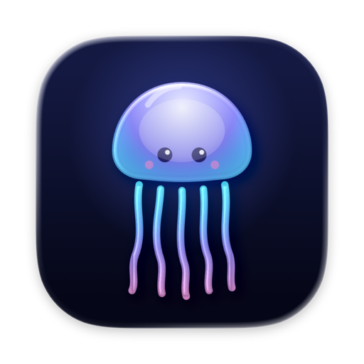
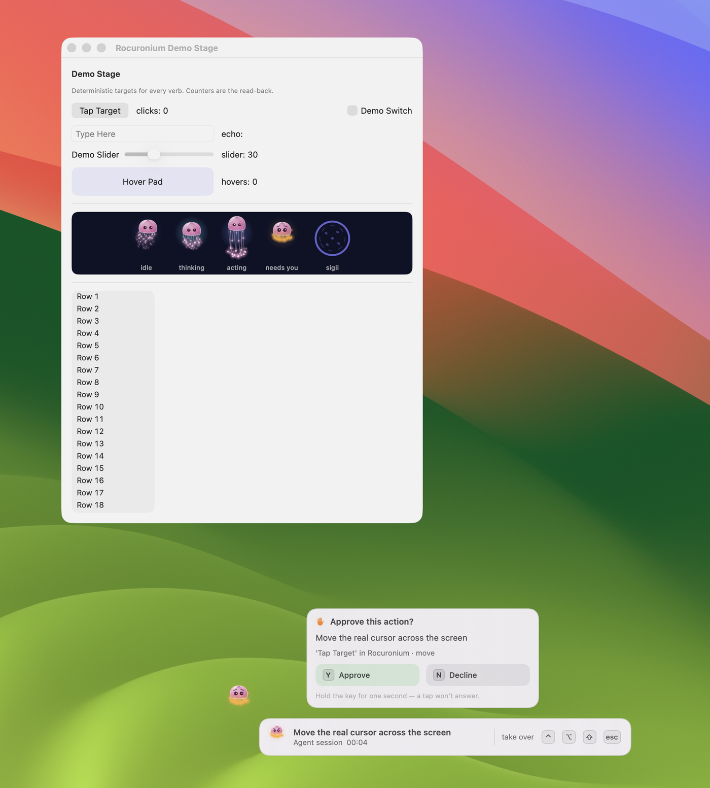

# rocuronium

**Drive this Mac without taking the cursor.**

A menu bar daemon that lets an AI agent see and operate macOS — read text, click buttons,
type, scroll, drag, draw — while the human keeps their cursor, their focus, and a kill
switch. Every action returns **evidence** of what observably happened, because
accessibility APIs routinely lie about success.



*A cursor-taking action while someone is at the machine: the jellyfish marks where the agent is, the prompt waits for a one-second hold on Y or N, and the bezel narrates the action with the shortcut that halts everything.*

## What makes it different

**Ghost input.** Most actions are delivered through accessibility and per-process posted
events — no cursor movement, no focus change, invisible to the person at the keyboard.
The agent works *beside* you, not *instead of* you.

**Evidence, not return codes.** Every action is verified: text is read back after writing,
pixels are compared before and after, window counts are checked, process exits are
detected. The reply says `confirmed`, `noEffect`, or `unverifiable` — and `noEffect`
(the API said "success" but nothing changed) is the most important one.

**The human is never locked out.** Cursor-taking actions show a presence overlay — a
jellyfish escorting the cursor, a bezel narrating what's happening. Touch the mouse and
the gesture yields. Press Ctrl+Option+Shift+Escape and everything stops within one
sample (~8 ms). Resume is a button in the menu bar and nothing else — the agent cannot
un-halt itself.

**A virtual display for isolation.** Park a window onto an invisible headless display,
work on it there with full hardware input (no occlusion, no screen real estate), put it
back. The display exists only while a lease holds it and sweeps every window home on
teardown.

**Sequence plans.** Execute multi-step flows as one daemon-side operation — click, wait
for the dialog, type, verify the field — with postcondition guards between steps and
failure policies (abort, continue, pause-for-human, fallback). No round-trips between
steps means the world can't change mid-sequence.

**Diff perception.** Read an app's text for a fraction of a screenshot's cost; pass the
observation token back and get only what changed — elements appeared, vanished, values
moved. Screenshots diff the same way: changed-region crops instead of the whole frame,
scroll detection with revealed-edge strips.

**Vision when the tree lies.** About a sixth of Mac apps expose no usable accessibility
tree. A three-tier cascade covers them: accessibility first, then a local
[UI-element detector](https://huggingface.co/kageroumado/rocuronium-ui-detector) — a
5.4 MB CoreML YOLOv11n, ~8 ms per window — plus OCR to turn an icon toolbar into
addressable boxes, then a local VLM for the rest. `read --ocr` and `find --ocr` return the
parsed rows, and `groundedBy` on every row says which tier answered.

## Install

```bash
brew install kageroumado/tap/rocuronium
```

Or download the DMG from [Releases](https://github.com/kageroumado/rocuronium/releases).

Grant **Accessibility** (required) and **Screen Recording** (for screenshots and
`scroll --until-text` OCR) in System Settings > Privacy & Security.

## Quick start

```bash
rocuronium status                          # is the daemon running, what can I see
rocuronium read --app TextEdit             # dump the app's text via accessibility
rocuronium click --app Safari --label Done # click a button without touching the cursor
rocuronium type --app Notes --text "hello" # type into the focused field
rocuronium shortcut --app Notes --keys cmd+c  # copy the selection (real clipboard, with a verdict)
rocuronium screenshot --app Finder         # capture a window (occlusion-proof)

rocuronium mcp                             # start the MCP server (stdio)
```

## MCP

Add to your Claude Code config:

```json
{
  "mcpServers": {
    "rocuronium": {
      "command": "/Applications/Rocuronium.app/Contents/Resources/rocuronium",
      "args": ["mcp"]
    }
  }
}
```

All verbs are exposed as MCP tools with the same names and arguments.

## Commands

| | Verbs |
|---|---|
| **Observe** | `status` `diag` `apps` `windows` `find` `read` `wait` `screenshot` `activity` |
| **Act** | `type` `click` `key` `shortcut` `menu` `scroll` `statusitem` `launch` `activate` |
| **Cursor** | `move` `drag` (hardware — takes the real cursor, presence-gated) |
| **Orchestrate** | `plan` (multi-step with guards) |
| **Isolate** | `display` (virtual display lease) `park` (move window to it) |
| **Meta** | `busy` (hold the presence overlay up while working) `demo` (practice window) `request-capture` `mcp` |

One coordinate frame everywhere: points, origin at the top-left of the main display.
`rocuronium --help` lists every flag; each MCP tool carries its own contract in its description.

## Safety model

Two invariants hold for every action:

1. **The cursor is never taken without opt-in.** Ghost delivery (accessibility writes,
   per-process posted events) is the default. Hardware input — the path that moves the
   real cursor — requires an explicit flag and is refused while a human is present, while
   the screen is locked, or while another window covers the target.

2. **Every action returns evidence.** The three verdicts (`confirmed` / `noEffect` /
   `unverifiable`) are the contract. The system exists because `AXSetValue` reports
   success on WebKit while changing nothing, `AXPerformAction` reports success on
   background menus that were never validated, and posted wheel events are silently
   ignored by every modern toolkit.

The emergency stop (Ctrl+Option+Shift+Escape) halts everything within one cursor sample.
Resume is a button in the menu bar popover — no socket command can clear the halt.

## Stack

Swift 6.2 with strict concurrency and `@MainActor` isolation by default. A menu-bar app
that holds the Accessibility grant, plus a dependency-free CLI that speaks to it over a
Unix-domain socket. The CLI is also the MCP server.

**Apple frameworks**

- **Accessibility** (ApplicationServices) — reading trees, `AXPress`/`AXSetValue` delivery
- **CoreGraphics / CGEvent** — per-process posted events (ghost input) and cursor paths
- **ScreenCaptureKit** — occlusion-proof window captures and region diffs
- **Vision** — on-device OCR (the `scroll --until-text` and `--ocr` paths)
- **CoreML** — the UI-element detector runs on the Neural Engine (`.cpuAndNeuralEngine`)
- **SwiftUI + AppKit** — menu-bar popover and the presence overlay
- **Carbon / IOKit / Synchronization** — the ⌃⌥⇧⎋ global kill switch, the virtual display,
  the lock-free cursor-sampling thread

**Swift packages**

- [Propofol](https://github.com/kageroumado/propofol) — the menu-bar popover UI kit
- [mlx-swift + mlx-swift-lm](https://github.com/ml-explore/mlx-swift-lm) — local VLM
  inference on Apple silicon
- [swift-transformers](https://github.com/huggingface/swift-transformers) — HuggingFace Hub
  model downloads and tokenizers

**Vision models**

- [rocuronium-ui-detector](https://huggingface.co/kageroumado/rocuronium-ui-detector) —
  YOLOv11n trained with [Ultralytics](https://github.com/ultralytics/ultralytics) on
  [GroundCUA](https://huggingface.co/datasets/ServiceNow/GroundCUA) (ServiceNow, Apache-2.0),
  exported to CoreML, hosted on HuggingFace (Apache-2.0)
- [Holo 3.1 4B](https://huggingface.co/pipenetwork/Holo-3.1-4B-MLX-4bit) — GUI-grounding
  VLM, downloaded on demand and run through MLX

**Interface**

- [Model Context Protocol](https://modelcontextprotocol.io) — every verb exposed as an MCP
  tool with the same name and arguments

## Documentation

- **[`.claude/skills/rocuronium`](.claude/skills/rocuronium)** — the agent's operator guide as a Claude Code skill: `SKILL.md` plus a `reference/` folder (the reply contract, targeting, acting, vision, plans, presence, isolation). It ships inside the app and the CLI: `rocuronium guide` prints it (or one reference, `rocuronium guide acting`), `rocuronium guide --install` copies it to `~/.claude/skills/rocuronium`, and the menu-bar popover offers the same install when the copy there is missing or out of date.
- `rocuronium --help` — every command and flag.
- Each MCP tool carries its own contract in its description.
- [`CLAUDE.md`](CLAUDE.md) — architecture and invariants for working on the code.

## License

[MIT](LICENSE)
